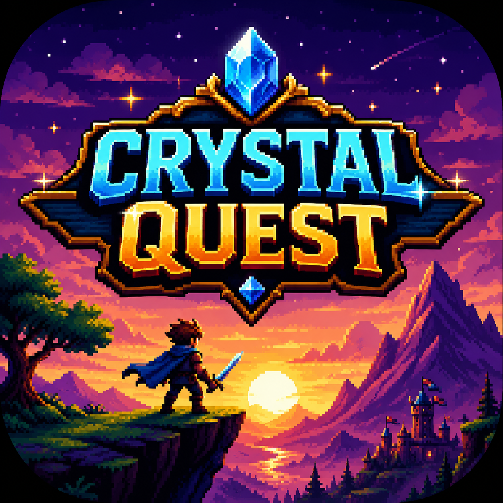
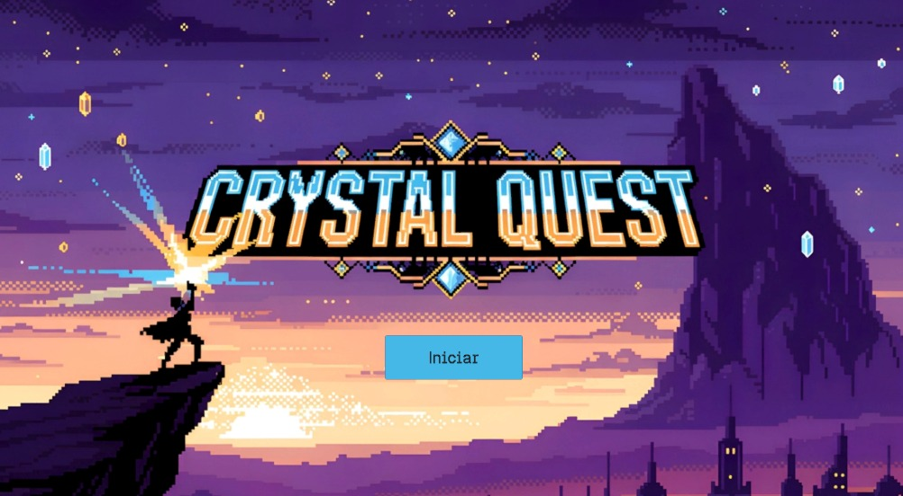
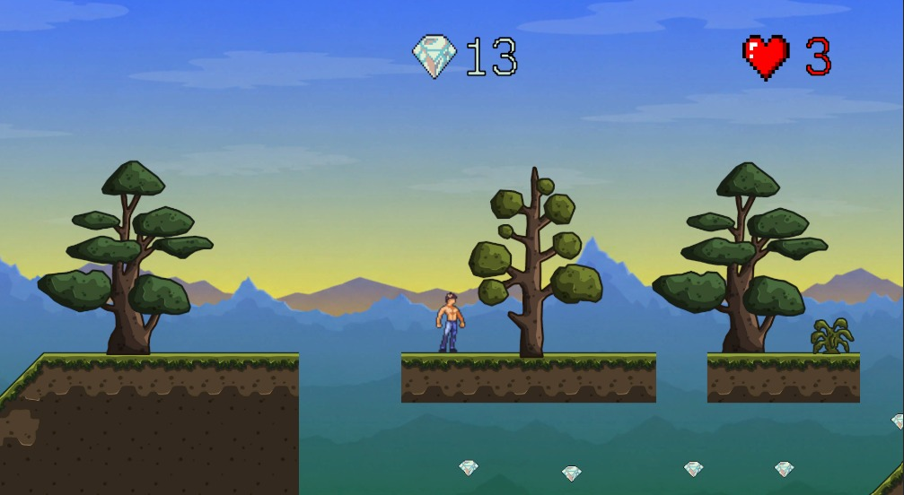
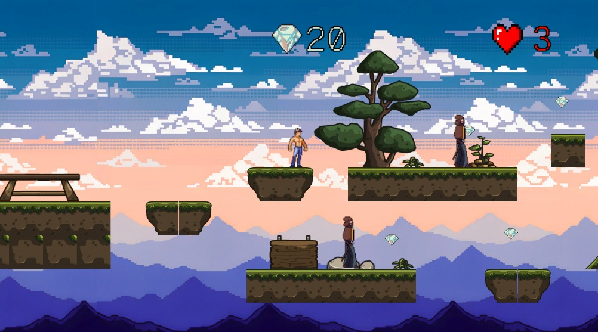
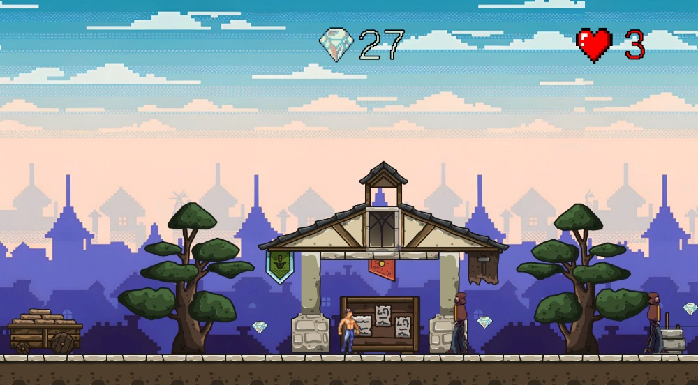
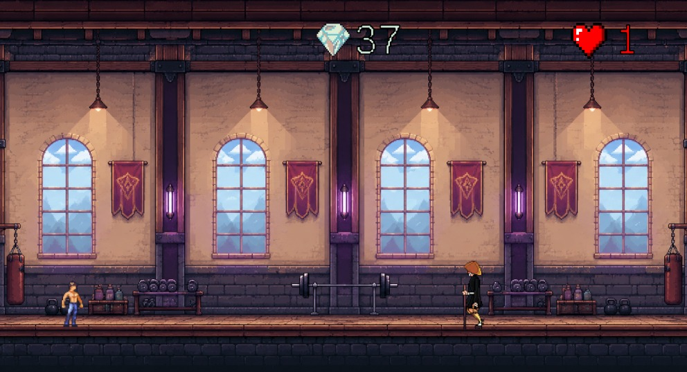
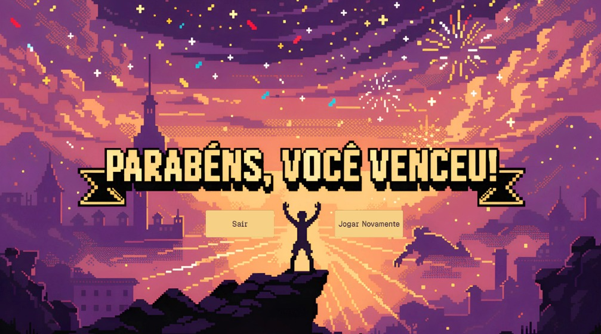

# Crystal Quest

<p align="center">
  
</p>

<h1 align="center">Crystal Quest</h1>

<p align="center">
  Um jogo de plataforma 2D desenvolvido na <strong>Unity 6</strong> utilizando <strong>C#</strong>.
</p>

<p align="center">
  
  
  
  
</p>

---

# 📖 Índice

- [🎮 Sobre o Projeto](#-sobre-o-projeto)
- [🎯 Objetivos](#-objetivos)
- [✨ Principais Mecânicas](#-principais-mecânicas)
- [🕹 Controles](#-controles)
- [🗺 Fases](#-fases)
- [❤️ Sistema de Vidas](#-sistema-de-vidas)
- [💎 Sistema de Pontuação](#-sistema-de-pontuação)
- [👾 Inimigos](#-inimigos)
- [👑 Boss Final](#-boss-final)
- [🔊 Áudio](#-áudio)
- [🖼 Assets Utilizados](#-assets-utilizados)
- [🛠 Tecnologias](#-tecnologias)
- [📂 Estrutura do Projeto](#-estrutura-do-projeto)
- [🚀 Como Executar](#-como-executar)
- [📦 Conteúdo do Repositório](#-conteúdo-do-repositório)
- [👨‍💻 Desenvolvedor](#-desenvolvedor)
- [📄 Licença](#-licença)

---

# 🎮 Sobre o Projeto

**Crystal Quest** é um jogo de plataforma 2D desenvolvido como projeto da disciplina de **Game Development** utilizando a **Unity 6** e a linguagem **C#**.

O jogador deve atravessar diferentes cenários coletando cristais enquanto enfrenta desafios progressivamente mais difíceis. Ao longo da aventura surgem inimigos, obstáculos e, ao final, um chefe que precisa ser derrotado para concluir o jogo.

Durante o desenvolvimento foram aplicados conceitos de:

- Programação Orientada a Objetos (POO)
- Física 2D
- Gerenciamento de Cenas
- HUD
- Áudio
- Animações
- Feedback visual
- Persistência de objetos entre cenas

---

# 🎯 Objetivos

- Desenvolver um jogo completo de plataforma 2D.
- Aplicar os conhecimentos adquiridos na disciplina.
- Utilizar C# para implementar mecânicas de jogo.
- Explorar recursos da Unity 6.
- Criar um projeto para composição de portfólio.

---

# ✨ Principais Mecânicas

- Movimentação lateral
- Sistema de pulo
- Sistema de vidas
- Sistema de pontuação
- Coleta de cristais
- Knockback ao receber dano
- Sprite Flash ao sofrer dano
- Inimigos com patrulhamento automático
- Boss Fight
- Progressão entre fases
- HUD dinâmica
- Música contínua entre as fases
- Tela inicial
- Tela de vitória
- Efeitos sonoros

---

# 🕹 Controles

| Tecla | Função |
|------|---------|
| **A** | Andar para a esquerda |
| **D** | Andar para a direita |
| **Espaço** | Pular |

---

# 🗺 Fases

## 🏠 Menu Inicial

Tela responsável por iniciar a aventura.

<p align="center">

</p>

---

## 🌿 Level 1

Primeira fase do jogo.

**Características**

- Introdução aos controles
- Aprendizado da movimentação
- Coleta de cristais
- Sem inimigos

<p align="center">

</p>

---

## 🌲 Level 2

Introdução aos inimigos.

**Características**

- Patrulhamento automático
- Sistema de dano
- Knockback
- Coleta de cristais

<p align="center">

</p>

---

## 🏔 Level 3

A dificuldade aumenta.

**Características**

- Mais inimigos
- Obstáculos maiores
- Continuação da coleta de cristais

<p align="center">

</p>

---

## 👑 Boss Level

Última fase do jogo.

**Características**

- Chefe final
- Sistema de múltiplas vidas
- Feedback visual ao receber dano
- Efeitos sonoros
- Vitória ao derrotá-lo

<p align="center">

</p>

---

## 🏆 Tela de Vitória

Após derrotar o Boss, o jogador é direcionado para a tela final.

<p align="center">

</p>

---

# ❤️ Sistema de Vidas

O jogador inicia a partida com **3 vidas**.

Ao sofrer dano:

- perde uma vida;
- recebe knockback;
- o personagem pisca em branco indicando o dano recebido;
- ao perder todas as vidas, retorna para a primeira fase.

---

# 💎 Sistema de Pontuação

Cristais espalhados pelas fases aumentam a pontuação do jogador.

A pontuação permanece visível durante toda a gameplay através da HUD.

---

# 👾 Inimigos

Os inimigos possuem:

- Patrulhamento automático;
- Mudança de direção ao chegar nas bordas;
- Dano por contato;
- Possibilidade de serem derrotados ao serem pulados;
- Sprite Flash ao morrer;
- Efeitos sonoros.

---

# 👑 Boss Final

O chefe representa o último desafio do jogo.

Características:

- Movimentação automática;
- Sistema de múltiplas vidas;
- Feedback visual ao receber dano;
- Efeitos sonoros;
- Tela de vitória após ser derrotado.

---

# 🔊 Áudio

Para aumentar a imersão, foram utilizados diferentes efeitos sonoros.

### Sons implementados

- 👣 Passos
- ⬆️ Pulo
- 👊 Dano recebido
- 💎 Coleta de cristal
- 💀 Derrota de inimigos
- 🎵 Música de fundo
- 🖱️ Botões do menu

---

# 🖼 Assets Utilizados

O projeto utiliza assets gratuitos de terceiros para fins educacionais.

Incluem:

- Sprites dos personagens
- Cenários Pixel Art
- Tilesets
- HUD
- Fontes
- Trilhas sonoras
- Efeitos sonoros

Todos os créditos pertencem aos respectivos autores.

---

# 🛠 Tecnologias

- Unity 6
- C#
- Visual Studio Code
- Git
- GitHub
- TextMesh Pro
- Unity Physics 2D

---

# 📂 Estrutura do Projeto

```text
CrystalQuest
│
├── Assets
│   ├── Animations
│   ├── Materials
│   ├── Prefabs
│   ├── Scenes
│   ├── Scripts
│   ├── Sounds
│   ├── Sprites
│   ├── TileMaps
│   └── Settings
│
├── Build
├── Packages
├── ProjectSettings
└── README.md
```

---

# 🚀 Como Executar

## Executável

1. Baixe a versão mais recente em **Releases**.
2. Extraia o arquivo `.zip`.
3. Execute:

```text
Crystal Quest.exe
```

---

## Projeto Unity

Clone o repositório:

```bash
git clone https://github.com/MuriloWeishaupt/CrystalQuest.git
```

Abra o projeto utilizando a **Unity 6**, carregue a cena **MenuScreen** e clique em **Play**.

---

# 📦 Conteúdo do Repositório

- Código-fonte em C#
- Prefabs
- Scripts
- Sprites
- Áudios
- Animações
- Materiais
- Cenas
- Build do jogo
- Capturas de tela
- Documentação

---

# 👨‍💻 Desenvolvedor

**Murilo Weishaupt**

Projeto desenvolvido para a disciplina de **Game Development**, com o objetivo de aplicar conceitos de desenvolvimento de jogos 2D utilizando Unity e C#, além de compor um portfólio voltado à área de desenvolvimento de software.

---

# 📄 Licença

Este projeto foi desenvolvido exclusivamente para fins acadêmicos e educacionais.

Os assets utilizados pertencem aos seus respectivos autores e seguem suas respectivas licenças de distribuição.
